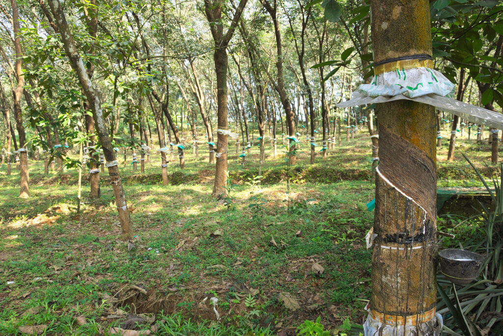

Like any other economy,Kerala should play into her strengths and hedge against her weaknesses in order to make it more vibrant.The strengths include:

---

#### Industries and Innovation

Kerala's capital city Trivandrum,and Cochin are among the hotspots in South India for service industries,apart from Bangalore and Hyderabad. It also boasts of a thriving startup ecosystem that meets global standards,Profoundis being an example. **Fledgling startups like Xwards explore hitherto untapped arenas like Digital Out Of Home advertising,which enables higher growth potential for the economy.**

Startup spirit should be spread amongst the youth and incubation centres should be set up in colleges itself. More ventures like Startup Village should be set up to guide and incubate young entrepreneurs,thus providing additional employment and income.

Kerala's exquisite cuisines and delicacies also find great demand across the world. Startups like Mr.James Joseph's Jackfruit365 is a case in point. Many more of such ideas should come up and those should be encouraged for a lively startup culture in Kerala.

#### Tourism

The 'God's own country' is blessed with lush green fields,exquisite lagoons and backwaters,historically important spots and a pleasant climate,all that makes it a tourists' paradise. Kerala's rich cultural heritage,which has given India the famous dance forms of Kathakali and Mohiniyattam;the unique boat-racesand the vibrancy of festivals like Onam and Thrissur pooram,attracts millions of tourists from all over the world to Kerala every year.

Tourism sector,although of satisfactory standards,still lacks efficient infrastructure like speedy transportation and last mile connectivity. Safetyof tourists is another concern,as a number of instances of misbehaviour towards tourists are reported every year. Kerala also lacks quality professionals in hospitality management sector.

Upgrading infrastructure facilities,improving the security through increased manpower of police and creating new professional courses in hospitality management would do wonders.

#### Agriculture

Being a State at the western coast and the first Indian State to recieve South-West Monsoon,Kerala is comparitively blessed with essentials for a thriving agricultural sector. The State has been hailed since the British era for its suitablity for plantation agriculture. The reputation of Kerala spices lured travellers like Vasco Da Gamma to Kerala,even centuries back.Yet,the full potential of agriculture sector is not realised in Kerala for a variety of reasons,disenchantment of the present generation with agriculture being the primary one.

Agriculture and farming should be given a fresh breath of life,both by government-level interventions and awareness campaigns among people. Awareness about various government initiatives like Fasal Bima Yojana,Krishi Sinchayee Yojana,Soil Health Card,Kisan Credit Cards etc should be spread more. Examples of successful entrepreneurs in agriculture like this should be brought into public attention to encourage youth to take up agriculture as a career.

#### Fisheries,aquaculture and other practices

Blessed with a long coastline and plenty of waterbodies over the length and breadth of the State,Kerala offers an ideal environment for fisheries and aquaculture. Other farming practises like apiculture,hydroponics,vertical farming etc. should be encouraged at policy levels for better diversification of agriculture in the State.

#### Ayurveda,Siddha and Naturopathy

Kerala is renowned all over the world for her Ayurveda practitioners and the invaluable knowledge they possess,which had been exchanged over many generations. This is also an attractive factor for Kerala tourism. Measures to preserve the traditional knowledge of these practitioners should be taken up. Siddha and Naturopathy centres also has much to offer for Health and Wellness Centres, a part of Aayushman Bharat,recently announced in the Union Budget.

At the same time,a major weakness against which Kerala's economy should be hedged on a wartime footing is its dwindling remittances,especially from Middle-East. Remittances alone account for nearly 25% of the State's Net Domestic Product. Increased indigenisation of workforce,a crippled oil-economy and a general economic slowdown across the world force many West Asian Keralite exapats to return home for good. This is set to have a huge impact on the State's economy,which could be minimised by:
1. Creating job opportunities for returnee expats-especially unskilled labourers-in unorganised sector along with social security.
2. Encouraging skilled migration to countries like USA,Canada and Australia,where opportunities for professionals are in plenty.
3. Reforming and updating the curriculum for professional courses so that it aligns with the demands of global industries,thus making migration easier for professionals.

Kerala should also take notice of the ongoing revolutions in the fields of Big Data,Artificial Intelligence,Deep Learning and Blockchain,in order to make its employment sector future proof. Already strong at IT and service sector,Kerala has an edge in leading the nation during the Fourth Industrial Revolution.

With Human Development Indices comparable to those of Western countries,Kerala boasts of an economy that is potent to scale even more heights than now. Careful policy planning is essential for the same.

